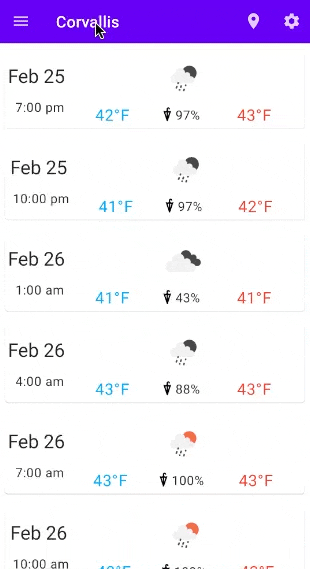

# Assignment 4
**Due by 11:59pm on Monday, 3/8/2021**  
**Demo due by 5:00pm on Friday, 3/19/2021**

In this assignment, we'll use the [Room persistence library](https://developer.android.com/training/data-storage/room) to incorporate an SQLite database into our weather app to save the locations for which the user requests a forecast.  There are a few different tasks associated with this assignment, described below.  This repository provides you with some starter code that implements the ViewModel-based weather app from assignment 3.

**NOTE: make sure to add your own API key as described in [`MainActivity.java`](app/src/main/java/com/example/android/sqliteweather/MainActivity.java#L33-L52) to make the app work.**

You can see a screen capture demonstrating the app's functionality below:

## 1. Add a navigation drawer to your app

First, add a navigation drawer to your app.  The navigation drawer should be accessible via a "hamburger" icon in the navigation bar in the app's main activity.  For now, you can simply add some dummy content into the drawer so you can see it in open and close.

## 2. Incorporate an SQLite database to save forecast locations

Next, use the Room persistence library to incorporate into your app an SQLite database in which you'll save the locations (i.e. cities) for which the user requests a weather forecast.  You'll want to store two different pieces of data for each location in the database:
  * The name of the location/city
  * A timestamp indicating when the user last viewed a forecast of this city (we'll see in a minute how this is used)

To make this work with the Room persistence library, you'll need to define an Entity, a Data Access Object (DAO), and a Database class.

## 3. Save the locations for which the user requests a forecast

Now, modify your app so that whenever the user changes the forecast location in the preferences, the new location is saved into the database you just created.  A given location should be stored at most once in the database.  In other words, your database should not contain duplicate locations.  To save locations into the database, you'll have to implement an `OnSharedPreferenceChangedListener` that detects when the location preference has changed and saves a location into the database if it's not already there.

## 4. List the saved locations in the navigation drawer using a `RecyclerView`

Next, add a `RecyclerView` to your navigation drawer that lists the locations saved in the database.  Importantly, the locations should be listed *in order from most-recently viewed (at the top of the list) to least-recently viewed (at the bottom of the list)*.  The easiest way to do this will be to formulate your database query to fetch locations in the correct order.

Since you're using a new `RecyclerView`, you'll need to implement an `Adapter` class to manage the underlying location data that's displayed in the list, as well as a `ViewHolder` and a layout associated with a single item in your `RecyclerView` list.  This layout can be very simple, containing only the location name.

**Note that the `RecyclerView` you implement here will take the place of the `NavigationView` we used in the code we implemented in lecture.**  In other words, you won't use a `NavigationView` in this assignment.  You'll have a `RecyclerView` in the navigation drawer instead.

## 5. Update the forecast location when the user clicks on a location in the navigation drawer

Finally, hook your app up so that when the user clicks on an item in your navigation drawer `RecyclerView`, the following three actions occur:
  * The navigation drawer closes.
  * The app displays the forecast for the location corresponding to the item that was clicked.
  * The "last viewed" timestamp is updated to "now" in the database for the location corresponding to the item that was clicked.

The easiest way to do this will be to implement a click listener that's set up similar to the one we implemented to launch a new activity when the user clicked a forecast item in the main activity's main `RecyclerView`.  Remember that to make that work, we implemented an `interface` that we used to invoke a method in the main activity class from the `ViewHolder` associated with the clicked item in the forecast list.  If you take this `interface`-based approach, the method in the main activity that's called in response to clicks in the navigation drawer `RecyclerView` will perform the three actions listed above.

Note that since the starter code with which you're provided is already hooked up to update the displayed forecast whenever the value of the location preference is changed in `SharedPreferences`, the most straightforward way to display the forecast for the clicked location would probably be to use a [`SharedPreferences.Editor`](https://developer.android.com/reference/android/content/SharedPreferences.html#edit()) to modify the location stored in the shared preferences (making sure to [apply the changes](https://developer.android.com/reference/android/content/SharedPreferences.Editor.html#apply())).  This approach has the added benefit that the app will always display the forecast for the last-selected location whenever the user quits and restarts the app.  In fact, it's quite common in practice to utilize programmatically set `SharedPreferences` values in this way.

## Extra credit: A better way to enter a new city

The flow we implemented above works alright to allow the user to add cities to the database and select them to view their weather forecasts, but the user's experience of having to enter a city in the app's preferences in order to be able to select that city in the navigation drawer is a poor one.

For up to 10 points worth of extra credit, you can implement a better user experience by adding an element (e.g. a clickable entry with a "+" sign) at the top of the navigation drawer on which the user can click to add a new location to the database.  When the user clicks this element, your app should open a dialog that prompts the user to enter a new forecast location.  If the user clicks an "accept" button in the dialog, the location they entered should be added into to the database and thus displayed in the navigation drawer.

For more on dialogs in Android, see this page:

https://developer.android.com/guide/topics/ui/dialogs

If you choose to implement the extra credit, you may get rid of the location preference from the preferences screen.  Note that it may still be useful to use the location preference and its key as a mechanism for triggering a new forecast to be fetched and for storing the location for which the forecast was last requested.

You can see a screen capture demonstrating this extra credit functionality below:

## Extra credit: Kotlin implementation

As always, you may also implement this assignment using Kotlin instead of Java for extra credit.  To earn this extra credit, you must still implement the app to use the Room persistence library for data storage, as described above.  Note that you may have to replace some of the Java starter code with Kotlin to be able to implement the app described above.

## Submission

As usual, we'll be using GitHub Classroom for this assignment, and you will submit your assignment via GitHub.  Make sure your completed files are committed and pushed by the assignment's deadline to the master branch of the GitHub repo that was created for you by GitHub Classroom.  A good way to check whether your files are safely submitted is to look at the master branch your assignment repo on the github.com website (i.e. https://github.com/osu-cs492-w21/assignment-4-YourGitHubUsername/). If your changes show up there, you can consider your files submitted.

## Grading criteria

This assignment is worth 100 points, broken down as follows:

  * 10 points: app includes a navigation drawer
  * 15 points: Room persistence components (Entity, DAO, and Database) are appropriately defined
  * 20 points: locations are added into the database when the user enters them in the preferences screen (if they don't already exist in the database)
  * 25 points: navigation drawer displays the locations stored in the database using a `RecyclerView`
  * 10 points: locations listed in the navigation drawer are ordered from most-recently viewed to least-recently viewed
  * 20 points: clicking a location in the navigation drawer displays the forecast for the selected location

In addition, you may earn up to 10 points worth of extra credit for implementing the dialog-based mechanism described above for entering a new forecast location.

You may also earn 10 points of extra credit for implementing your app using Kotlin.  Note that if you use Kotlin, your app will still be graded as normal based on the criteria described above.
